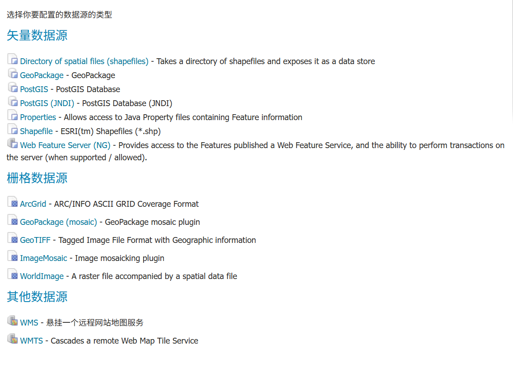

## web服务
- WMS(Web Map Service)：地图影像服务(渲染好的地图)
- WFS(Web Feature Service)：矢量数据服务(原始数据，可交互查询、编辑)
- WCS(Web Coverage Service)：栅格数据服务(遥感影像、高程数据等)
- WMTS(Web Map Tile Service)：瓦片地图服务(预先切好的地图瓦片)

## EPSG
- `EPSG:4326`：WGS84坐标系，单位为度(经纬度)
- `EPSG:3857`：Web墨卡托投影坐标系，单位为米(常用于Web地图)
- `EPSG:4490`：CGCS2000坐标系，中国国家测绘局制定，单位为度(经纬度)
- `EPSG:3415`：CGCS2000大地坐标系，单位为米(常用于中国的工程测量)
- `EPSG:2362`：西安80坐标系，单位为米(常用于中国的老旧测量数据)
- `EPSG:2383`：北京54坐标系，单位为米(常用于中国的老旧测量数据)