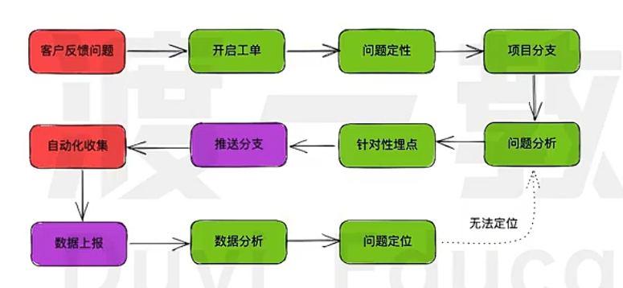
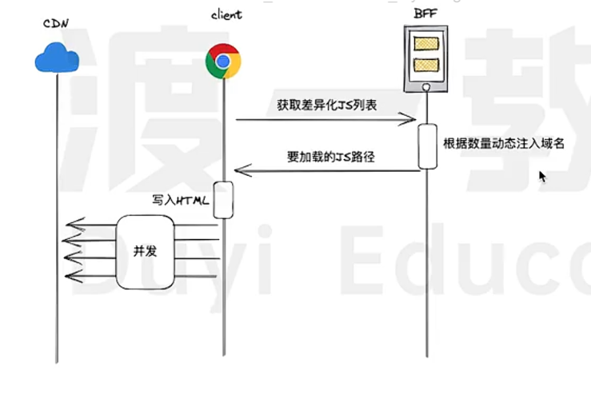

# 原生课程
## 首屏优化  
定位到问题后，再去解决问题，具体情况具体分析
### 问题的收集与分析
- 猜想->收集->分析->猜想  
- 工单完整流程————数据埋点

### 措施的制定与实施
1. 对头阻塞
    - 浏览器针对同一域名可以支持最多6个tcp并发连接，超越这个数字后将发生对头阻塞
    - 多开连接，多域名并行加载
    
    - 对于Ajax，拦截器动态切换请求库的地址
2. 头部臃肿(针对ajax,http1.1,借鉴2)
    - 表格头部压缩，前端、bff
3. 重复代码
    - 低码自动化创建差异化文件
    - 对重复代码的提取动态完成，嗅探
        - 如何找到 ast 分析抽象语法树，bff层面完成
            - 抽象语法树分析
            - 树结构对比
            - hash运算
            - 数据库存储
        - 何时提重 异步延时
4. 无差别加载
    - 视口内需要的先加载，不需要的延迟加载
        - 动态引入
        - 对于低代码
            - 定义视口内组件
            - 表示文件对应的组件
5. 针对大量api网络请求
    - 加入短时缓存，相同请求走缓存通道

## 简历
- 项目名
- 岗位
- 项目介绍
- 项目职责
- 项目亮点
    - lcp
## 面试
1. 如何实现首屏优化
    - *策略的制定*————定位问题、解决问题、测试反馈

# gis针对
## 思路
1. 首屏“慢”具体慢在哪？
   - 网络 / 计算 / 渲染 / 线程 / 策略
2. 用户第一眼需要看到什么？
   - 底图？轮廓？占位？
3. 哪些数据是“必须首屏”的？
   - 其他一律延后
4. 是否存在：
   - 精度分级
   - 时间分级
   - 空间分级
5. 是否阻塞了主线程？

## 首屏优化  
定位到问题后，再去解决问题，具体情况具体分析
### 问题的收集与分析
- 猜想->收集->分析->猜想  
- 工单完整流程————数据埋点
- 关键埋点指标
    - 首屏时间
        - 地图容器可见时间
        - 底图首瓦片可见时间
    - 交互延迟
        - zoom/pan到首帧渲染完成
    - 数据层
        - GeoJSON首次渲染耗时
        - 3DTiles首次可见时间
    - 用户差异
        - 设备
        - 网络

### 措施的制定与实施
1. 对头阻塞
    - `WebGIS`中
        - 场景
            - 底图瓦片大量并发请求(XYZ/WMTS)
            - POI、天气、路径等同时请求
        - 解决
            - 多域名瓦片并行
            - 请求数据与瓦片请求拆域
                - tiles.xxx.com
                - api.xxx.com
    - 浏览器针对同一域名可以支持最多6个tcp并发连接，超越这个数字后将发生对头阻塞
    - 多开连接，多域名并行加载
    
    - 对于Ajax，拦截器动态切换请求库的地址
2. 头部臃肿(针对ajax,http1.1,借鉴2)
    - 在`WebGIS`中
        - 场景
            - token、用户态、坐标系信息、时间参数
        - 映射做法
            - bff统一注入
            - 短token/session映射
            - geo接口定制
    - 表格头部压缩，前端、bff
3. 重复代码
    - 在`WebGIS`中
        - 场景
            - 多个地图页面
            - 多套图层逻辑
            - 多个业务线复用同一套渲染模式
    - 低码自动化创建差异化文件
    - 对重复代码的提取动态完成，嗅探
        - 如何找到 ast 分析抽象语法树，bff层面完成
            - 抽象语法树分析
            - 树结构对比
            - hash运算
            - 数据库存储
        - 何时提重 异步延时
4. 无差别加载
    - 在`WebGIS`中
        - 只加载当前 bbox 内的数据
            - bbox:当前地图视口覆盖的地理范围
        - 缩放级别决定数据精度
        - 图层懒加载（未开启不请求）
    - 视口内需要的先加载，不需要的延迟加载
        - 动态引入
        - 对于低代码
            - 定义视口内组件
            - 表示文件对应的组件
5. 针对大量api网络请求
    - 在`WebGIS`中
        - 场景
            - 同一路径反复请求
                - 地图操作时，使相同的数据反复请求
            - 同一bbox在短时间多次进入
                - 例如瓦片的显示
            - 拖拽地图时重复命中区域
                - 视口重叠内容反复请求
        - 解决
            - 关键：GIS里地图是连续的，数据是离散的
            - bbox + zoom + time 作为 cache key
            - 内存缓存+失效时间
                ```javascript
                //请求的数据先保留
                const cache = new Map()
                cache.set(key, {
                  data,
                  expireAt: Date.now() + 30_000 // 30 秒
                })
                //下次请求
                if (cache.has(key) && !expired) {
                  return cache.get(key).data
                }
                ```
            - 合并请求————用户停止移动后再请求
    - 加入短时缓存，相同请求走缓存通道
6. 底图策略优化
    - 常见问题
        - 一上来就请求高 zoom 瓦片
        - 多图层同时抢首屏
    - 优化思路
        - 先低 zoom 快速铺满
        - 高 zoom 瓦片延迟替换
        - 首屏只加载 1 个底图
    - 本质：先给用户“有地图”的感觉
## 简历
- 项目名
- 岗位
- 项目介绍
- 项目职责
- 项目亮点
    - 针对 WebGIS 首屏加载慢的问题，设计并实现了一套基于用户视口和缩放级别的渐进式加载策略
    - 通过多域名并行加载地图瓦片与业务数据，降低 HTTP 对头阻塞对首屏渲染的影响
    - 引入短时缓存机制，减少高频 bbox 请求导致的重复网络开销
    - 结合图层声明式配置与懒加载机制，实现复杂 GIS 图层的按需加载，显著优化 LCP 与交互响应时间
    - lcp
## 面试
1. 如何实现首屏优化
    - *策略的制定*————定位问题、解决问题、测试反馈

        

